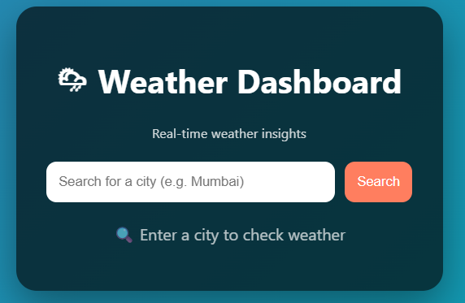
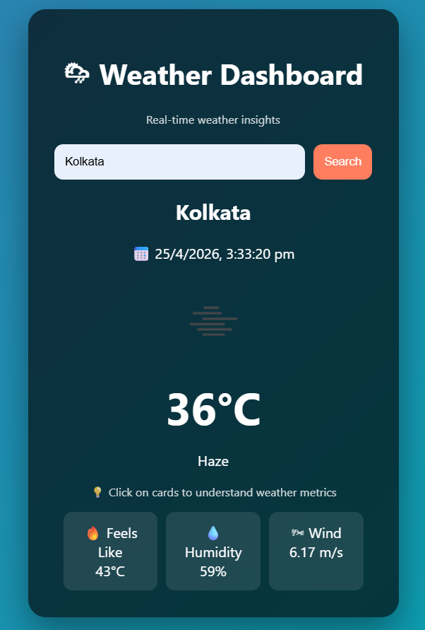
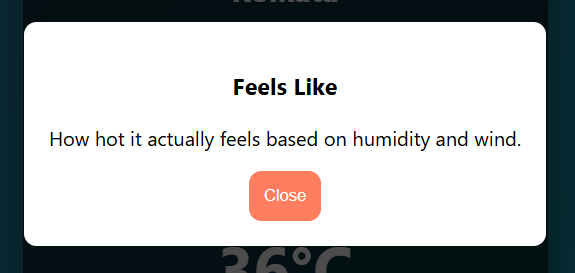

# 🌦 Weather Dashboard

A modern and interactive weather dashboard built using HTML, CSS, and JavaScript with OpenWeather API integration.

## 🚀 Features
- Real-time weather data
- Clean & premium UI
- Input validation
- Interactive info cards (click to understand weather metrics)
- Dynamic background based on weather conditions
- User-friendly empty state (no default city)

## 🛠 Tech Stack
- HTML
- CSS
- JavaScript
- OpenWeather API

## 📸 Screenshots

## 🔗 Live Demo
https://prince-weather-dashboard.netlify.app

## 💡 What I Learned
- API integration using JavaScript
- Handling user input and validation
- Designing clean UI/UX
- Deploying projects using Netlify
